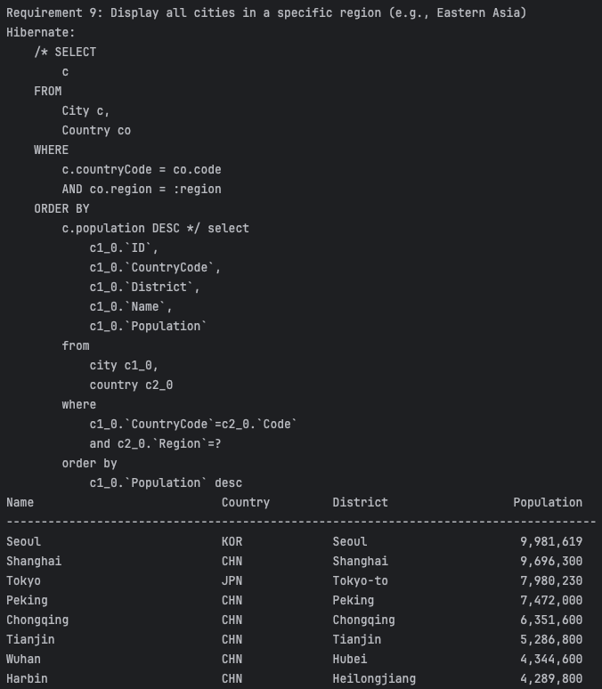
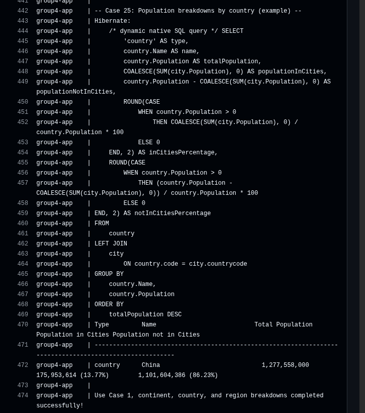

## Group-4-DevOps

### Build Status

**Master branch:**  

**Develop branch:**  

**Milestone**

## Code cove

## Reporting Bugs

If you find a bug, please open an issue using our [Bug Report template](https://github.com/DevOps-Group4-2025/Group-4-DevOps/issues/new?template=bug_report.md). Include steps to reproduce, expected behaviour, and screenshots if possible.

**Status:**  
✅ **14 of 32 requirements implemented — 43.75% complete**

| ID | Requirement | Met | Screenshot |
|----|--------------|-----|-------------|
| 1 | All the countries in the world organised by largest population to smallest. | ✅ Yes |  |
| 2 | All the countries in a continent organised by largest population to smallest. | ⚙️ In Progress |  |
| 3 | All the countries in a region organised by largest population to smallest. | ⚙️ In Progress |  |
| 4 | The top N populated countries in the world where N is provided by the user. | ⚙️ In Progress |  |
| 5 | The top N populated countries in a continent where N is provided by the user. | ⚙️ In Progress |  |
| 6 | The top N populated countries in a region where N is provided by the user. | ⚙️ In Progress |  |
| 7 | All the cities in the world organised by largest population to smallest. | ✅ Yes |  |
| 8 | All the cities in a continent organised by largest population to smallest. | ✅ Yes |  |
| 9 | All the cities in a region organised by largest population to smallest. | ✅ Yes |  |
| 10 | All the cities in a country organised by largest population to smallest. | ✅ Yes |  |
| 11 | All the cities in a district organised by largest population to smallest. | ✅ Yes |  |
| 12 | The top N populated cities in the world where N is provided by the user. | ✅ Yes |  |
| 13 | The top N populated cities in a continent where N is provided by the user. | ✅ Yes |  |
| 14 | The top N populated cities in a region where N is provided by the user. | ✅ Yes |  |
| 15 | The top N populated cities in a country where N is provided by the user. | ✅ Yes |  |
| 16 | The top N populated cities in a district where N is provided by the user. | ✅ Yes |  |
| 17 | All the capital cities in the world organised by largest population to smallest. | ⚙️ In Progress |  |
| 18 | All the capital cities in a continent organised by largest population to smallest. | ⚙️ In Progress |  |
| 19 | All the capital cities in a region organised by largest to smallest. | ⚙️ In Progress |  |
| 20 | The top N populated capital cities in the world where N is provided by the user. | ⚙️ In Progress |  |
| 21 | The top N populated capital cities in a continent where N is provided by the user. | ⚙️ In Progress |  |
| 22 | The top N populated capital cities in a region where N is provided by the user. | ⚙️ In Progress |  |
| 23 | The population of people, people living in cities, and people not living in cities in each continent. | ✅ Yes |  |
| 24 | The population of people, people living in cities, and people not living in cities in each region. | ✅ Yes |  |
| 25 | The population of people, people living in cities, and people not living in cities in each country. | ✅ Yes |  |
| 26 | The population of the world. | ⚙️ In Progress |  |
| 27 | The population of a continent. | ⚙️ In Progress |  |
| 28 | The population of a region. | ⚙️ In Progress |  |
| 29 | The population of a country. | ⚙️ In Progress |  |
| 30 | The population of a district. | ⚙️ In Progress |  |
| 31 | The population of a city. | ⚙️ In Progress |  |
| 32 | Languages reports. | ⚙️ In Progress |  |

## About the Project

**Group-4 DevOps** is a population insights reporting service for the SET09803 DevOps module.  
It turns the classic **MySQL “world”** database into clear, reproducible reports for analysts, with a strong focus on DevOps practice: **GitFlow** (master/develop/feature), **automated CI** with GitHub Actions, **Dockerized** runtime, and **versioned releases**.

### What it delivers
- **Countries**: all / by continent / by region + **Top-N** variants
- **Cities**: world, continent, region, country, district + **Top-N** variants
- **Capital Cities**: world / continent / region + **Top-N**
- **Population Breakdowns**: in-cities vs not-in-cities for **continent / region / country**
- **Population Totals**: world / continent / region / country / district / city
- **Languages**: speakers of Chinese, English, Hindi, Spanish, Arabic (with % of world)

### Tech stack
- **Java 17** + **Maven** (builds self-contained JAR)
- **MySQL 8** (supplied *world* dataset)
- **Docker / Docker Compose** (app + DB)
- **GitHub Actions** (build & test on `feature/*`, `develop`, and `master`)
- **Releases**: tagged and documented (e.g., `v0.1.0`)

### Why it matters
The reports support quick analysis of **urbanisation**, **regional planning**, and **language reach**, giving stakeholders a consistent, auditable way to query global population data.

