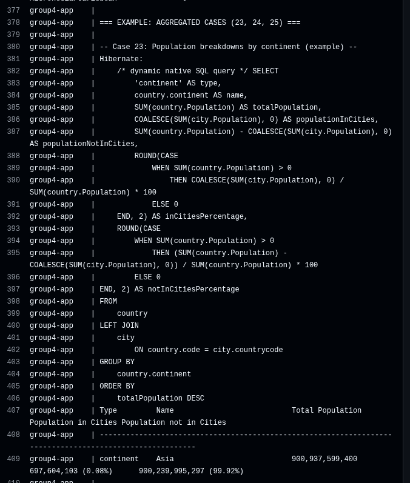

## Group-4-DevOps

### Build Status

**Master branch:**  

## Coverage Badge from codecov

## Code coverage generated by Python locally 

**Develop branch:**  

**Milestone**

## Reporting Bugs

If you find a bug, please open an issue using our [Bug Report template](https://github.com/DevOps-Group4-2025/Group-4-DevOps/issues/new?template=bug_report.md). Include steps to reproduce, expected behaviour, and screenshots if possible.

**Status:**  
✅ **16 of 32 requirements implemented — 50% complete**

**Status:**  
✅ **22 of 32 requirements implemented — 69% complete**

| ID | Requirement                                                                                           | Met            | Screenshot     | Log File             |
|----|-------------------------------------------------------------------------------------------------------|----------------|----------------|----------------------|
| 1  | All the countries in the world organised by largest population to smallest.                           | ✅ Yes          |  | [usecase1.log](https://github.com/DevOps-Group4-2025/Group-4-DevOps/blob/master/output/usecase1.log) |
| 2  | All the countries in a continent organised by largest population to smallest.                         | ✅ Yes          |  | [usecase2.log](https://github.com/DevOps-Group4-2025/Group-4-DevOps/blob/master/output/usecase2.log) |
| 3  | All the countries in a region organised by largest population to smallest.                            | ⚙️ In Progress |                | 🚫 Not generated     |
| 4  | The top N populated countries in the world where N is provided by the user.                           | ⚙️ In Progress |                | 🚫 Not generated     |
| 5  | The top N populated countries in a continent where N is provided by the user.                         | ⚙️ In Progress |                | 🚫 Not generated     |
| 6  | The top N populated countries in a region where N is provided by the user.                            | ⚙️ In Progress |                | 🚫 Not generated     |
| 7  | All the cities in the world organised by largest population to smallest.                              | ✅ Yes          |  | [usecase7.log](https://github.com/DevOps-Group4-2025/Group-4-DevOps/blob/master/output/usecase7.log) |
| 8  | All the cities in a continent organised by largest population to smallest.                            | ✅ Yes          |  | [usecase8.log](https://github.com/DevOps-Group4-2025/Group-4-DevOps/blob/master/output/usecase8.log) |
| 9  | All the cities in a region organised by largest population to smallest.                               | ✅ Yes          |  | [usecase9.log](https://github.com/DevOps-Group4-2025/Group-4-DevOps/blob/master/output/usecase9.log) |
| 10 | All the cities in a country organised by largest population to smallest.                              | ✅ Yes          |  | [usecase10.log](https://github.com/DevOps-Group4-2025/Group-4-DevOps/blob/master/output/usecase10.log) |
| 11 | All the cities in a district organised by largest population to smallest.                             | ✅ Yes          |  | [usecase11.log](https://github.com/DevOps-Group4-2025/Group-4-DevOps/blob/master/output/usecase11.log) |
| 12 | The top N populated cities in the world where N is provided by the user.                              | ✅ Yes          |  | [usecase12.log](https://github.com/DevOps-Group4-2025/Group-4-DevOps/blob/master/output/usecase12.log) |
| 13 | The top N populated cities in a continent where N is provided by the user.                            | ✅ Yes          |  | [usecase13.log](https://github.com/DevOps-Group4-2025/Group-4-DevOps/blob/master/output/usecase13.log) |
| 14 | The top N populated cities in a region where N is provided by the user.                               | ✅ Yes          |  | [usecase14.log](https://github.com/DevOps-Group4-2025/Group-4-DevOps/blob/master/output/usecase14.log) |
| 15 | The top N populated cities in a country where N is provided by the user.                              | ✅ Yes          |  | [usecase15.log](https://github.com/DevOps-Group4-2025/Group-4-DevOps/blob/master/output/usecase15.log) |
| 16 | The top N populated cities in a district where N is provided by the user.                             | ✅ Yes          |  | [usecase16.log](https://github.com/DevOps-Group4-2025/Group-4-DevOps/blob/master/output/usecase16.log) |
| 17 | List all capital cities in the world by population.                                                   | ✅ Yes          |  | [usecase17.log](https://github.com/DevOps-Group4-2025/Group-4-DevOps/blob/master/output/usecase17.log) |
| 18 | List all capital cities in a continent by population.                                                 | ✅ Yes          |  | [usecase18.log](https://github.com/DevOps-Group4-2025/Group-4-DevOps/blob/master/output/usecase18.log) |
| 19 | List all capital cities in a region by population.                                                    | ✅ Yes          |  | [usecase19.log](https://github.com/DevOps-Group4-2025/Group-4-DevOps/blob/master/output/usecase19.log) |
| 20 | Top N capital cities in the world by population.                                                      | ✅ Yes          |  | [usecase20.log](https://github.com/DevOps-Group4-2025/Group-4-DevOps/blob/master/output/usecase20.log) |
| 21 | Top N capital cities in a continent by population.                                                    | ✅ Yes          |  | [usecase21.log](https://github.com/DevOps-Group4-2025/Group-4-DevOps/blob/master/output/usecase21.log) |
| 22 | Top N capital cities in a region by population.                                                       | ✅ Yes          |  | [usecase22.log](https://github.com/DevOps-Group4-2025/Group-4-DevOps/blob/master/output/usecase22.log) |
| 23 | The population of people, people living in cities, and people not living in cities in each continent. | ✅ Yes          |  | [usecase23.log](https://github.com/DevOps-Group4-2025/Group-4-DevOps/blob/master/output/usecase23.log) |
| 24 | The population of people, people living in cities, and people not living in cities in each region.    | ✅ Yes          |  | [usecase24.log](https://github.com/DevOps-Group4-2025/Group-4-DevOps/blob/master/output/usecase24.log) |
| 25 | The population of people, people living in cities, and people not living in cities in each country.   | ✅ Yes          |  | [usecase25.log](https://github.com/DevOps-Group4-2025/Group-4-DevOps/blob/master/output/usecase25.log) |
| 26 | The population of the world.                                                                          | ✅ Yes          |  | [usecase26.log](output/usecase26.log) |
| 27 | The population of a continent.                                                                        | ✅ Yes          |  | [usecase27.log](output/usecase27.log) |
| 28 | The population of a region.                                                                           | ✅ Yes          |  | [usecase28.log](output/usecase28.log) |
| 29 | The population of a country.                                                                          | ✅ Yes          |  | [usecase29.log](output/usecase29.log) |
| 30 | The population of a district.                                                                         | ✅ Yes          |  | [usecase30.log](output/usecase30.log) |
| 31 | The population of a city.                                                                             | ✅ Yes          |  | [usecase31.log](output/usecase31.log) |
| 32 | Languages reports.                                                                                    | ⚙️ In Progress |                | 🚫 Not generated     |

## About the Project

**Group-4 DevOps** is a population insights reporting service for the SET09803 DevOps module.  
It turns the classic **MySQL “world”** database into clear, reproducible reports for analysts, with a strong focus on DevOps practice: **GitFlow** (master/develop/feature), **automated CI** with GitHub Actions, **Dockerized** runtime, and **versioned releases**.

### What it delivers
- **Countries**: all / by continent / by region + **Top-N** variants
- **Cities**: world, continent, region, country, district + **Top-N** variants
- **Capital Cities**: world / continent / region + **Top-N**
- **Population Breakdowns**: in-cities vs not-in-cities for **continent / region / country**
- **Population Totals**: world / continent / region / country / district / city
- **Languages**: speakers of Chinese, English, Hindi, Spanish, Arabic (with % of world)

### Tech stack
- **Java 17** + **Maven** (builds self-contained JAR)
- **MySQL 8** (supplied *world* dataset)
- **Docker / Docker Compose** (app + DB)
- **GitHub Actions** (build & test on `feature/*`, `develop`, and `master`)
- **Releases**: tagged and documented (e.g., `v0.1.0`)

### Why it matters
The reports support quick analysis of **urbanisation**, **regional planning**, and **language reach**, giving stakeholders a consistent, auditable way to query global population data.

